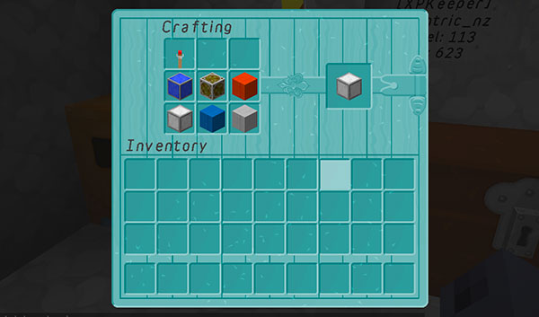
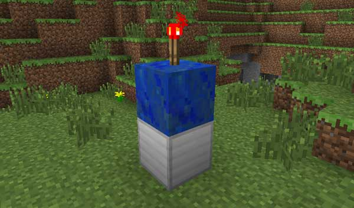

**@deprecated**

## TARDIS Seed Blocks - TARDIS v2.6.2 - v3.6.2

This is the old way to craft TARDIS seed blocks!

A seed block requires seven different components as explained below. You can mix and match your own combination of blocks (19,450,850 different combinations with the default plugin configuration) to customise the appearance of your TARDIS.

The crafting grid above shows how to craft the default ‘budget’ TARDIS with a blue Police Box **(TARDIS v3.6.2 and lower)**:

- **IRON block** = TARDIS type, can be any of the current TARDIS ‘type’ blocks e.g. IRON, GOLD, DIAMOND, EMERALD etc ([see list below](#types))
- **LAPIS block** = required block
- **REDSTONE TORCH** = required block
- **BLUE WOOL** = Police Box wall block, can be any block from the `chameleon_blocks` configuration section in _[blocks.yml](https://github.com/eccentricdevotion/TARDIS/blob/v4.0/src/main/resources/blocks.yml#L129-L307)_
- **REDSTONE LAMP** = Police Box lamp, can be any block from the `lamp_blocks` configuration section in _[blocks.yml](https://github.com/eccentricdevotion/TARDIS/blob/v4.0/src/main/resources/blocks.yml#L308-L314)_
- **LIGHT GREY WOOL** = TARDIS interior floor block, can be any valid [TARDIS wall block](https://github.com/eccentricdevotion/TARDIS/blob/v4.0/src/main/resources/blocks.yml#L4-L127)
- **ORANGE WOOL** = TARDIS interior wall block, can be any valid [TARDIS wall block](https://github.com/eccentricdevotion/TARDIS/blob/v4.0/src/main/resources/blocks.yml#L4-L127)

Once the required and chosen blocks are placed in the crafting grid, a TARDIS seed block is automatically generated.

Seed blocks can be placed, broken and dropped and still remain as a valid seed block.

## TARDIS types

- IRON BLOCK - default “budget” TARDIS interior
- COAL BLOCK - “steampunk” TARDIS interior
- LAPIS BLOCK - “Tom Baker” TARDIS interior
- QUARTZ BLOCK - “ARS” TARDIS interior
- BOOKSHELF - “wood plank” TARDIS interior
- REDSTONE BLOCK - “redstone” TARDIS interior
- GOLD BLOCK - “bigger” TARDIS interior
- DIAMOND BLOCK - “deluxe” TARDIS interior
- EMERALD BLOCK - “eleventh doctor’s” TARDIS interior
- PRISMARINE BLOCK - “Twelfth doctor’s” TARDIS interior
- SANDSTONE STAIRS - Sandstone Pyramid TARDIS interior
- NETHER BRICK BLOCK - The Master’s TARDIS interior
- NETHER WART BLOCK - “coral” TARDIS interior
- PURPUR BLOCK - “ender” TARDIS interior
- OBSIDIAN BLOCK - “custom” (server created) TARDIS interior

## Legacy TARDIS creation

As of TARDIS version 2.6, seed blocks are now the default way to create a TARDIS. The instructions below are for versions prior to that, or if `use_block_stack: true` has been set in _config.yml_.

To create your TARDIS place any valid TARDIS type block (such as an Iron, Gold, Diamond, or Emerald Block) on the ground. These will determine the size of the inside of your TARDIS as shown in the [list above](#types).

On top of that place the desired interior wall block. Depending on what kind of block you use in the middle position you will get a different wall material for your TARDIS interior (except the ‘eleventh’ TARDIS which is always grey). The block you use here will also determine the material used for room walls (though you can change this preference later).

If you use a LAPIS BLOCK (the default) you will get ORANGE WOOL, which in combination with the [TARDIS Texture Pack](http://www.curse.com/texture-packs/minecraft/tardis-tp) will change to a custom TARDIS texture.

Otherwise you may choose from the following blocks:

    Lapis
    Brick
    Stone
    Dirt
    Wood - any type
    Sandstone
    Wool - any colour
    Netherrack
    Soul Sand
    Smooth Brick
    Ender stone
    and one other secret one!

Finally, place a Redstone Torch on top.

See the picture below for how it should look.

<iframe src="https://player.vimeo.com/video/57807690" width="600" height="366" frameborder="0" webkitallowfullscreen mozallowfullscreen allowfullscreen></iframe>

&nbsp;

**Next:** [Artron Energy](artron-energy.html)
